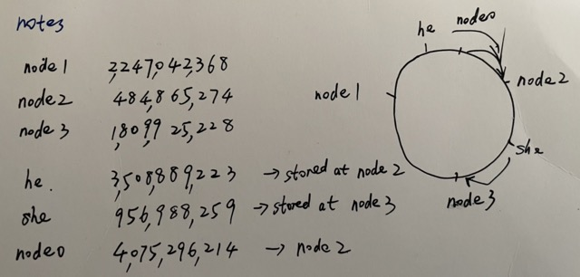
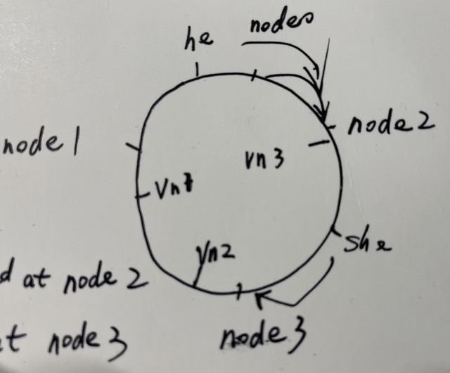
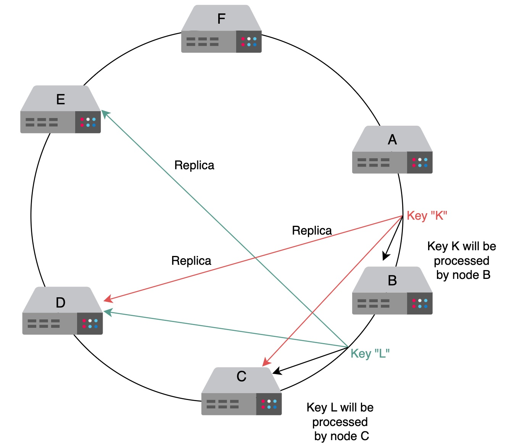

# System Design Interview

The final answer doesn’t matter.
What matters is the process and the journey that a good applicant takes the interviewer through.

## How to tackle a design question

- An applicant should ask the right questions to solidify the requirements.
- Applicants also need to scope the problem
  so that they’re able to make a good attempt at solving it within the limited time frame of the interview.
  SDIs are usually about 35 to 40 minutes long.
- Communication with the interviewer is critical.
  It’s not a good idea to silently work on the design.
  Instead, we should engage with the interviewer to ensure that they understand our thought process.

## Possible questions

- SDIs often include questions related to how a design might evolve over time as some aspect of the system increases
  by some order of magnitude—for example, the number of users, the number of queries per second, and so on.
- Another question in an SDI might be related to why we don’t design a system
  that’s already capable of handling more work than necessary or predicted.
  (the answer usually is the consideration of cost)

## Theory and practice

Distributed System

- Robustness (the ability to maintain operations during a crisis) 健壮性
- Scalability 用户规模可扩展性
- Availability 高可用性
- Performance 高性能
- Extensibility 组件或者模块可扩展性
- Resiliency (the ability to return to normal operations over an acceptable period of time post disruption)
- Consistency 数据一致性

make a trade-off between availability and consistency when network components fail
because the CAP theorem indicates that we can’t have both under network partitions.

any distributed data store can provide only two of the following three guarantees:

- Consistency:
  Every read receives the most recent write or an error.
- Availability:
  Every request receives a (non-error) response, without the guarantee that it contains the most recent write.
- Partition tolerance 分区容差:
  The system continues to operate despite an arbitrary number of messages being dropped (or delayed)
  by the network between nodes.

## The right direction

We should focus less on mechanics机制 and more on trade-offs权衡利弊.

## strategize, then divide and conquer 分而治之

Ask refining quesitons -> handle the data -> discuss the components -> discuss trade-offs

### Ask refining questions 提炼问题

Requirements that the clients need directly and indirectly

### Handle data 处理数据

- What’s the size of the data right now? 现在数据量的大小
- At what rate is the data expected to grow over time? 数据增长速度
- How will the data be consumed by other subsystems or end users? 数据对外接口
- Is the data read-heavy or write-heavy? 读取密集型还是写入密集型
- Do we need strict consistency of data, or will eventual consistency work? 数据的严格一致还是最终一致
- What’s the durability target of the data? 持久性要求
- What privacy and regulatory requirements do we require for storing or transmitting user data? 监管和法律要求

### Discuss the components

System components:

- Front-end components,
- load balancers,
- caches,
- databases,
- firewalls,
- and CDNs

### Discuss trade-offs

there’s no one correct answer to a design problem.

- Different components have different pros and cons.
- Different choices have different costs in terms of money and technical complexity.
- Every design has its weaknesses.
  We should point out weaknesses in our design to our interviewer and explain why we haven’t tackled them yet.
  Something is always failing in a big system. We need to integrate fault tolerance and security into our design.
  容错

## What not to do in an interview

- Don’t write code in a system design interview.
- Don’t start building without a plan.
- Don’t work in silence.
- Don’t describe numbers without reason. We have to frame it.
- If we don’t know something, we don’t paper over it, and we don’t pretend to know it.

## Building Blocks

- Domain name system(DNS)
- Load balancers 负载均衡器:
- Databases:
- Key-value store 键值对: Redis
- Content delivery network(CDN)
- Sequencer: generating unique IDs, uuid
- Service monitoring 服务监控: supervisor
- Distributed caching 分布式缓存: Redis,
- Distributed messaging queue 分布式消息队列: Redis, MQTT, NATS, RabbitMQ, ZMQ
- Publish-subscribe system: Redis, MQTT, NATS, RabbitMQ, ZMQ
- Rate limiter: throttles节流 incoming requests for a service based on the predefined limit, 避免DDOS攻击
- Blob store: 存储非结构化的文件，例如视频，音乐，二进制文件
- Distributed search 分布式搜索: Elasticsearch
- Distributed logging 分布式日志记录， I/O密集型
- Distributed task scheduling
- Shared counters: 高并发的读与写，例如名人推特的点赞数

## DNS
There are 13 logical root name servers (named letter A through M) with many instances spread throughout the globe. 
These servers are managed by 12 different organizations.
Roughly 1,000 replicated instances of 13 root-level servers are spread throughout the world
### The Important Detail

#### Name servers:
the DNS isn’t a single server

#### Resource records:
The RR is the smallest unit of information that users request from the name servers.

| Type  | Description                                                           | Name        | Value          | Example(Type,Name,Value)                                 |
|-------|-----------------------------------------------------------------------|-------------|----------------|----------------------------------------------------------|
| A     | Provides the hostname to IP address mapping                           | Hostname    | IP address     | (A, relay1.main.educative.io,104.18.2.119)               |
| NS    | Provides the hostname that is the authoritative DNS for a domain name | Domain name | Hostname       | (NS, educative.io, dns.educative.io)                     |
| CNAME | Provides the mapping from alias to canonical 权威性的 hostname            | Hostname    | Canonical name | (CNAME, educative.io, server1.primary.educative.io)      |
| MX    | Provides the mapping of mail server from alias to canonical hostname  | Hostname    | Canonical name | (MX, mail.educative.io, mailserver1.backup.educative.io) |

#### Caching
Caching can be implemented in the 
- browser, 
- operating systems, 
- local name server within the user’s network, 
- or the ISP’s DNS resolvers.
#### Hierarchy
- DNS resolver: 本地的或者操作系统里面的 DNS域名解析者
- Root-level name severs: 根域名服务器，例如 .com .cn .edu .io
- Top-level domain(TLD) name severs: These servers hold the IP addresses of authoritative name servers. 
  The querying party will get a list of IP addresses that belong to the authoritative servers of the organization.
- Authoritative name severs: These are the organization’s DNS name servers that provide the IP addresses of the web 
  or application servers.
DNS name processed from right to left

### Iterative versus recursive query resolution
iterative query is preferred to reduce query load on DNS infrastructure.

### Consistent
data is read frequently from DNS databases as compared to writing.
DNS provides eventual consistency and updates records on replicated servers lazily.

Consistency can suffer because of caching.
A solution is that each cached record comes with an expiration time called time-to-live (TTL).

```commandline
Franks-Mac:reading frank$ nslookup www.google.com
Server:         114.114.114.114
Address:        114.114.114.114#53

Non-authoritative answer:
Name:   www.google.com
Address: 142.250.176.4
```
`Non-authoritative answer` 代表是缓存数据的响应，而不是Google官方返回的响应

```commandline
Franks-Mac:reading frank$ dig www.google.com

; <<>> DiG 9.10.6 <<>> www.google.com
;; global options: +cmd
;; Got answer:
;; ->>HEADER<<- opcode: QUERY, status: NOERROR, id: 33984
;; flags: qr rd ra; QUERY: 1, ANSWER: 1, AUTHORITY: 0, ADDITIONAL: 1

;; OPT PSEUDOSECTION:
; EDNS: version: 0, flags:; udp: 4096
;; QUESTION SECTION:
;www.google.com.                        IN      A

;; ANSWER SECTION:
www.google.com.         2650    IN      A       142.250.176.4

;; Query time: 35 msec
;; SERVER: 114.114.114.114#53(114.114.114.114)
;; WHEN: Wed Mar 13 15:41:51 CST 2024
;; MSG SIZE  rcvd: 59
```
`www.google.com.         2650` 中的2650s代表 缓存中数据的有效期(TTL)，约44分钟
`Query time: 35 msec` 中的 35 毫秒代表 DNS响应时间

修改本地的网络的DNS设置为8.8.8.8之后
```commandline
Franks-Mac:reading frank$ nslookup www.google.com
Server:         8.8.8.8
Address:        8.8.8.8#53

Non-authoritative answer:
Name:   www.google.com
Address: 142.250.176.4
```
```commandline
Franks-Mac:reading frank$ dig www.google.com

; <<>> DiG 9.10.6 <<>> www.google.com
;; global options: +cmd
;; Got answer:
;; ->>HEADER<<- opcode: QUERY, status: NOERROR, id: 30690
;; flags: qr rd ra; QUERY: 1, ANSWER: 1, AUTHORITY: 0, ADDITIONAL: 1

;; OPT PSEUDOSECTION:
; EDNS: version: 0, flags:; udp: 4096
;; QUESTION SECTION:
;www.google.com.                        IN      A

;; ANSWER SECTION:
www.google.com.         2036    IN      A       142.250.176.4

;; Query time: 48 msec
;; SERVER: 8.8.8.8#53(8.8.8.8)
;; WHEN: Wed Mar 13 15:52:05 CST 2024
;; MSG SIZE  rcvd: 59
```
End users’ operating systems have configuration files (/etc/resolv.conf in Linux) with the DNS resolvers’ IP addresses
to resolve the chicken-and-egg problem.

## Load balancer(LB)
### 3 Advantages of LB
- Scalability: By adding servers, the capacity of the application/service can be increased seamlessly. 
  Load balancers make such upscaling or downscaling transparent to the end users. 无缝扩展或者收缩服务器数量
- Availability: Even if some servers go down or suffer a fault, the system still remains available. 
  One of the jobs of the load balancers is to hide faults and failures of servers. 高可用性，个别服务器故障不影响总体的服务
  avoid single point of failure(SPOF)
- Performance: Load balancers can forward requests to servers with a lesser load 
  so the user can get a quicker response time. This not only improves performance but also improves resource utilization.

### 3 possible places to put load balancers
web/gateway server <--> application/business logic server <--> database server
- Place LBs between end users of the application and web servers/application gateway.
- Place LBs between the web servers and application servers that run the business/application logic.
- Place LBs between the application servers and database servers.

### Other functionalities provided by LB
- Health checking
- TLS termination 可以帮助 end-servers 断开 TLS 连接（TCP 三次握手建立连接，客户端发起四次挥手断开连接，客户端发起三次挥手断开连接
  TLS。使用 HTTPS 发送 HTTP 请求时，首先使用三次握手建立可靠的 TCP 连接，之后就通过 TLS 四次握手交换双方的密钥。）
  [三次握手、七次握手、四次挥手](https://github.com/pro648/tips/blob/master/sources/%E4%B8%89%E6%AC%A1%E6%8F%A1%E6%89%8B%E3%80%81%E4%B8%83%E6%AC%A1%E6%8F%A1%E6%89%8B%E3%80%81%E5%9B%9B%E6%AC%A1%E6%8C%A5%E6%89%8B.md)
  public key 加密，private key 解密
- Predictive analytics 预见的分析流量拥堵
- Reduced human intervention 减少运维人员的手动干预，例如个别服务器宕机
- Service discovery 服务发现，通过查询已注册的微服务来发现新的上线的server 或者 服务。
- Security 减缓 Denial-of-service(DoS) 


### 作为中转站的 LB 自己如果挂了怎么办？ 
What if load balancers fail? Are they not a single point of failure (SPOF)?

LB 也要支持集群，主从方案，以用于主 LB 挂掉之后，切换至从 LB

## Database
- SQL (relational databases)
- NoSQL (non-relational databases)
### Limitations of file storage
- lack of Concurrency
- lack of granting different access right to different users
- lack of scalability
- lower speed when user number increased

### todo for myself
- Data replication
- Data partitioning
- PostgreSQL
- MySQL InnoDB engine

## Key-Value Store
Key-value stores are distributed hash tables (DHTs).

Examples of key-value store usage include:
- bestseller lists,
- shopping carts,
- customer preferences,
- session management,
- sales rank,
- and product catalogs.

Online transaction processing (OLTP) involves gathering input information, processing the data, 
and updating existing data to reflect the collected and processed information. 
The OLTP databases carry out day-to-day tasks like insertion, updating, and deletion of the data in the database.

traditional relational database management system (RDBMS)

### Ensure scalability
多个 Key-value nodes 的负载均衡方案
- 简单的用 hash 值对节点数取余数
- 一致性 hash 环
#### Consistent Hash 一致性hash
当节点数越多的时候，使用取模算法时（10%4 -> 10%5），需要迁移的数据就越多，
why should the keys that in servers that are functioning properly have to be remapped?
使用一致哈希时，需要迁移的数据就越少。所以，一致哈希算法具有较好的容错性和可扩展性。

Implemented this algorithm by crc32 in [go file](consistent-hashing.go), 

The ring looks like:


references:
- [Medium blog](https://medium.com/@sent0hil/consistent-hashing-a-guide-go-implementation-fe3421ac3e8f).

##### 数据倾斜和虚拟节点
但是，由于哈希计算的随机性，导致一致性哈希算法存在一个致命问题：数据倾斜，也就是说大多数访问请求都会集中少量几个节点的情况。
特别是节点太少情况下，容易因为节点分布不均匀造成数据访问的冷热不均。解决办法是引入虚拟节点。
假如有3个 hash 方法，给每个节点用这3个方法计算出它们在环上的位置。
当处理读写请求的时候，用一个 hash 方法计算这个请求应该在环上的位置，又计算到的顺时针方向的下一个节点处理请求。

Implemented virtual nodes by crc64 in [go file](consistent-hashing2.go).

The ring looks like:


虚拟节点的缺点:
- 一个或多个节点故障了会导致再次的数据倾斜

参考:
- [一致性hash](https://developer.aliyun.com/article/1082388)


### Ensure availability
Data replication
- Primary-secondary. However, if a primary server fails(single point of failure), we need to upgrade a secondary to a primary. 
  The availability of write will suffer as we won’t allow writes during the switch-over time.
  - lack of availability
- peer-to-peer. Usually, it’s inefficient and costly to replicate in all n nodes.
  - higher availability
  - lack of consistency
  复制也是在一致性 hash 环上面：当某个写入某个key时候，hash 方法计算出在环上的位置，由该位置的下一个节点负责写入数据，
  并且这个节点也就是协调者 coordinator，负责把数据备份到接下来的 n个实际节点上，如果遇到虚拟节点就决定是否跳过。
  To avoid putting replicas on the same physical nodes, the preference list can skip those virtual nodes 
  whose physical node is already in the list.
  

What is the impact of synchronous or asynchronous replication?
- synchronous 
  - longer response time to end user until replication is done
  - higher consistency
- asynchronous
  - quicker response time to end user
  - lower consistency, disconnection -> inconsistent -> conflicts/divergent ->
    How to deal with the conflicts？ -> versioning data
  
### Versioning Data


## references

- [educative](https://www.educative.io/courses/grokking-modern-system-design-interview-for-engineers-managers)

